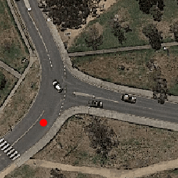
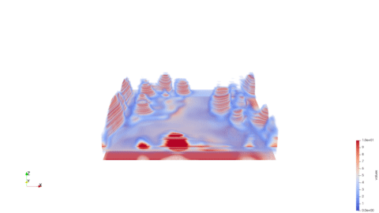

# EE798R (INTELLIGENT PATTERN RECOGNITION) PROJECT


> <p align="center" float="left">
>      
>    
>    
> </p>


## Checkpoints Downloading
```
bash scripts/download_weights.sh
```

## QuickStart Demo
### Video Synthesis
  #### Example Usage
  ```
  python test.py --yaml=sat2density_cvact \
    --test_ckpt_path=2u87bj8w \
    --task=test_vid \
    --demo_img=demo_img/case1/satview-input.png  \
    --sty_img=demo_img/case1/groundview.image.png  \
    --save_dir=results/case1
  ```
  #### 
We visualize our .vtk shape files with Paraview.

### Illumination Interpolation
<!-- ```
bash inference/quick_demo_interpolation.sh
``` -->
```
python test.py --task=test_interpolation \
--yaml=sat2density_cvact \
--test_ckpt_path=2u87bj8w \
--sty_img1=demo_img/case9/groundview.image.png \
--sty_img2=demo_img/case7/groundview.image.png \
--demo_img=demo_img/case3/satview-input.png \
--save_dir=results/case2
```


### Inference

To test Center Ground-View Synthesis setting
If you want save results, please add --task=vis_test
```bash
# CVACT
python offline_train_test.py --yaml=sat2density_cvact --test_ckpt_path=2u87bj8w
# CVUSA
python offline_train_test.py --yaml=sat2density_cvusa --test_ckpt_path=2cqv8uh4
```

To test inference with different illumination
```bash
# CVACT
bash inference/single_style_test_cvact.sh
# CVUSA
bash inference/single_style_test_cvusa.sh
```

To test synthesis ground videos
```bash
bash inference/synthesis_video.sh
```

## Training

### Training command

```bash
# CVACT
CUDA_VISIBLE_DEVICES=X python train.py --yaml=sat2density_cvact
# CVUSA
CUDA_VISIBLE_DEVICES=X python train.py --yaml=sat2density_cvusa
```


